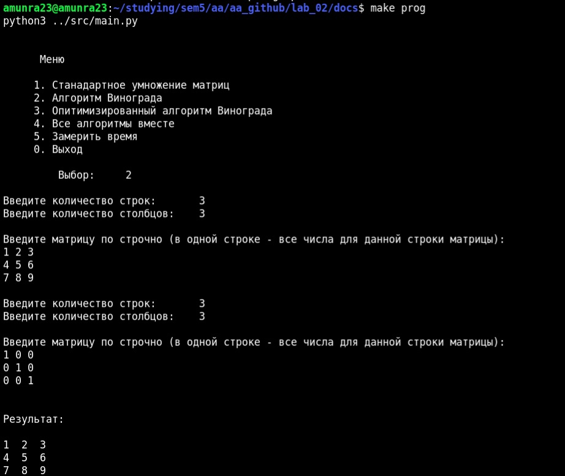

# Анализ Алгоритмов

 [Я в Телеграм](https://t.me/amunra2) 

# Лабораторная работа №2

## Цель

Целью данной работы является изучение, реализация и исследование алгоритмов умножения матриц - классический алгоритм, алгоритм Винограда и оптимизированный алгоритм Винограда.

## Ссылки

[Отчет](./docs/cvetkov53b_report.pdf)

[Код](./src)

## Запуск

0. Установить пакеты `python3`, `python-pip3`

1. Перейти в папку с исходным кодом
   
```bash
cd ./src
```

2. Установить зависмости
   
```bash
pip install -r requirements.txt
```

3. Запустить
   
```bash
python3 main.py
```

## Пример




_@amunra2 (2021г.)_
