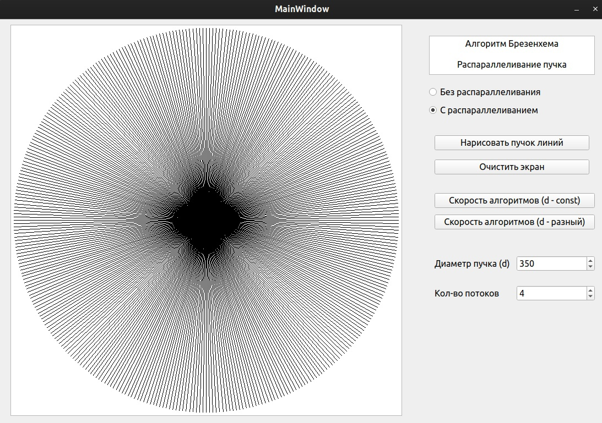

# Анализ Алгоритмов

 [Я в Телеграм](https://t.me/amunra2) 

# Лабораторная работа №4

## Цель

Целью данной работы является изучение параллельных вычислений. Исследование проводилось для пучка отрезков по алгоритму Брезенхема.

## Ссылки

[Отчет](./docs/cvetkov53b_report.pdf)

[Код](./src)

## Запуск

### Основное приложение

Приложение было разработано в `QtCreator5`. Запуск можно произвести с использованием файла проекта `project.pro`, если имеется установленный `Qt5`. Если нет, то:

0. Установить пакеты `qt5-qmake`, `libqt5charts5-dev`

1. Перейти в папку с исходным кодом
   
```bash
cd ./src
```

2. Собрать исполняемый файл
   
```bash
make
```

3. Запустить
   
```bash
./project
```

### Скрипт для построения графиков

0. Установить пакеты `python3`, `python-pip3`

1. Перейти в папку с исходным кодом
   
```bash
cd ./src
```

2. Установить зависмости
   
```bash
pip install -r requirements.txt
```

3. Запустить
   
```bash
python3 graph_build.py
```

## Пример




_@amunra2 (2021г.)_
