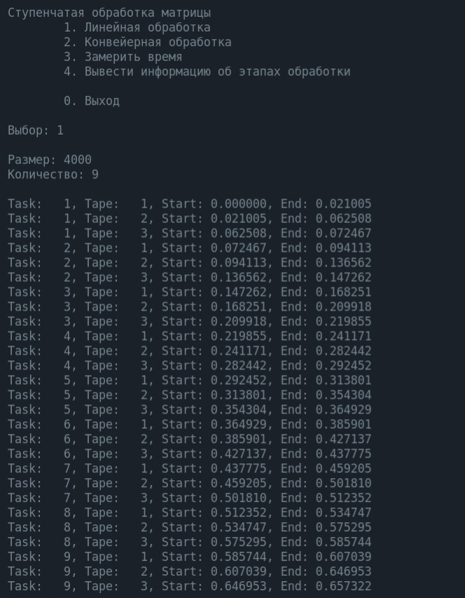
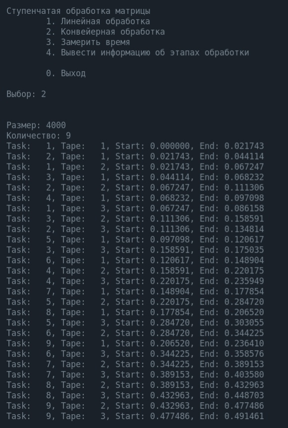

# Анализ Алгоритмов

 [Я в Телеграм](https://t.me/amunra2) 

# Лабораторная работа №5

## Цель

Целью данной работы является изучение принципов конвейрной обработки данных.

В качестве примера для конвейерной обработки будет обрабатываться матрица. Всего будет использовано три ленты, которые делают следующее.

1. Находится среднее арифмитическое значений матрицы.
2. Находится максимальный элемент матрицы.
3. Нечетный элемент матрицы заменяется на среднее арифметическое матрицы, а четные - на макимальный элемент.

## Ссылки

[Отчет](./docs/cvetkov53b_report.pdf)

[Код](./src)

## Запуск

### Основное приложение

1. Установить пакеты `qt5-qmake`

2. Перейти в папку с исходным кодом
   
```bash
cd ./src
```

2. Собрать исполняемый файл
   
```bash
make
```

3. Запустить
   
```bash
./project
```

### Скрипт для построения графиков

0. Установить пакеты `python3`, `python-pip3`

1. Перейти в папку с исходным кодом
   
```bash
cd ./src
```

2. Установить зависмости
   
```bash
pip install -r requirements.txt
```

3. Запустить
   
```bash
python3 graph_build.py
```


## Пример





_@amunra2 (2021г.)_
